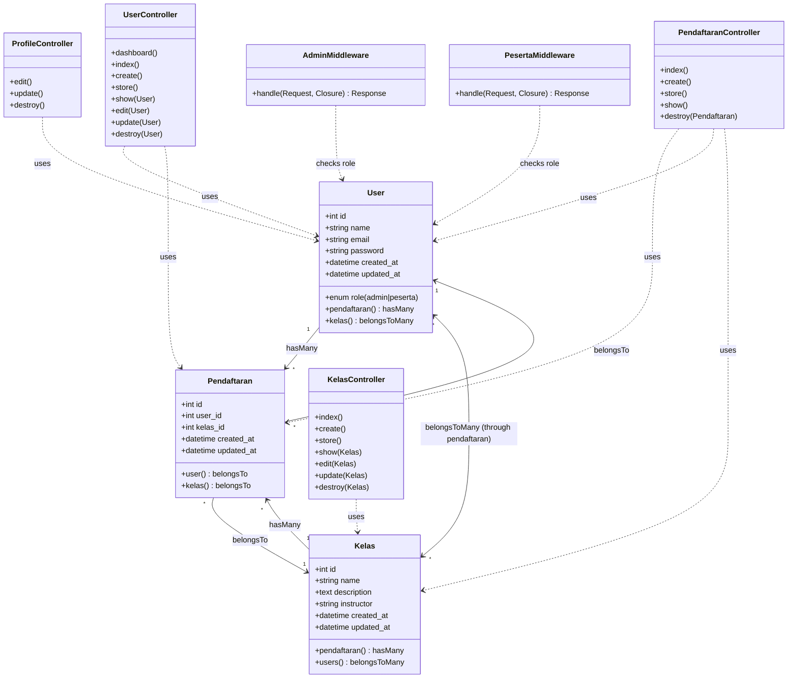

# Class Diagram - SkillHub Application

## UML Class Diagram

## Database Schema

### Users Table
- `id` (Primary Key)
- `name` (string)
- `email` (string, unique)
- `password` (string, hashed)
- `role` (enum: 'admin' | 'peserta', default: 'peserta')
- `created_at` (timestamp)
- `updated_at` (timestamp)

### Kelas Table
- `id` (Primary Key)
- `name` (string)
- `description` (text)
- `instructor` (string)
- `created_at` (timestamp)
- `updated_at` (timestamp)

### Pendaftaran Table
- `id` (Primary Key)
- `user_id` (Foreign Key → users.id, onDelete: cascade)
- `kelas_id` (Foreign Key → kelas.id, onDelete: cascade)
- `created_at` (timestamp)
- `updated_at` (timestamp)

## Relationships Explained

### 1. User ↔ Pendaftaran (One-to-Many)
- **Relationship**: `User hasMany Pendaftaran`
- **Description**: One user can have multiple registrations (pendaftaran records)
- **Implementation**: `$user->pendaftaran()` returns all registrations for that user

### 2. Kelas ↔ Pendaftaran (One-to-Many)
- **Relationship**: `Kelas hasMany Pendaftaran`
- **Description**: One class (kelas) can have multiple registrations
- **Implementation**: `$kelas->pendaftaran()` returns all registrations for that class

### 3. Pendaftaran → User (Many-to-One)
- **Relationship**: `Pendaftaran belongsTo User`
- **Description**: Each registration belongs to one user
- **Implementation**: `$pendaftaran->user` returns the user who registered

### 4. Pendaftaran → Kelas (Many-to-One)
- **Relationship**: `Pendaftaran belongsTo Kelas`
- **Description**: Each registration belongs to one class
- **Implementation**: `$pendaftaran->kelas` returns the class being registered for

### 5. User ↔ Kelas (Many-to-Many)
- **Relationship**: `User belongsToMany Kelas` (through `pendaftaran` pivot table)
- **Description**: Users can register for multiple classes, and classes can have multiple users
- **Implementation**: 
  - `$user->kelas()` returns all classes a user is registered for
  - `$kelas->users()` returns all users registered for a class
- **Pivot Table**: `pendaftaran` table acts as the intermediate table with `user_id` and `kelas_id`

## Controller Responsibilities

### UserController
- **Dashboard**: Renders admin or peserta dashboard based on user role
- **User Management**: Full CRUD operations for both admin and peserta users
- **Methods**: `dashboard()`, `index()`, `create()`, `store()`, `show()`, `edit()`, `update()`, `destroy()`

### KelasController
- **Class Management**: Full CRUD operations for classes
- **Methods**: `index()`, `create()`, `store()`, `show()`, `edit()`, `update()`, `destroy()`

### PendaftaranController
- **Registration Management**: Create, read, and delete operations for class registrations
- **Methods**: `index()`, `create()`, `store()`, `show()`, `destroy()`
- **Special Features**: 
  - Prevents duplicate registrations
  - Can filter by user or class
  - Shows registrations by user or by class

### ProfileController
- **User Profile**: Edit, update, and delete user profile
- **Methods**: `edit()`, `update()`, `destroy()`

## Middleware

### AdminMiddleware
- **Purpose**: Protects admin-only routes
- **Logic**: Checks if user is authenticated and has `role === 'admin'`
- **Response**: Redirects to login if not authenticated, returns 403 if not admin

### PesertaMiddleware
- **Purpose**: Protects peserta-only routes
- **Logic**: Checks if user is authenticated and has `role === 'peserta'`
- **Response**: Redirects to login if not authenticated, returns 403 if not peserta

## Route Structure

### Admin Routes (protected by `auth` + `admin` middleware)
- `/admin/dashboard` → `UserController@dashboard`
- `/admin/kelas/*` → `KelasController` (full CRUD)
- `/admin/peserta/*` → `UserController` (full CRUD)
- `/admin/pendaftaran/*` → `PendaftaranController` (CRUD)

### Peserta Routes (protected by `auth` + `peserta` middleware)
- `/peserta/dashboard` → `UserController@dashboard`

### Public Routes
- `/` → Welcome page
- `/login`, `/register` → Authentication routes

## Key Features

1. **Role-Based Access Control**: Users have roles (admin/peserta) that determine access
2. **Many-to-Many Relationship**: Users can register for multiple classes via the `pendaftaran` pivot table
3. **Cascade Deletion**: When a user or class is deleted, related registrations are automatically deleted
4. **Duplicate Prevention**: System prevents users from registering for the same class twice
5. **Role-Based Dashboards**: Different dashboards for admin and peserta users

